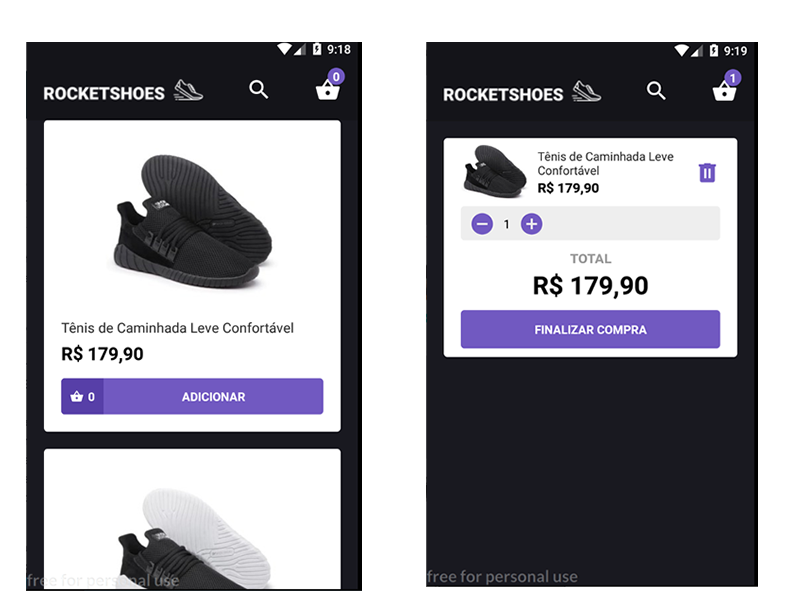

# Rocketshoes

### Aplicativo de catálogo de produtos

Este foi um desafio do curso de React Native do BootCamp da [RocketSeat](http://www.rocketseat.com.br)

Nesse desafio foi construida uma aplicação com interface de e-commerce, o usuário poderá
adicionar produtos ao carrinho e no final exibir o valor total do pedido. Ao adicionar o produto, é feito o controle de estoque.

Além disso, os dados de produtos e estoque virão de uma API local com json-server (o arquivo da
API está na raiz do projeto).

A interface da aplicação será como a seguinte:

Recursos que foram utilizados:

- React Navigation
- Axios
- ReactoTron
- Redux
- Saga
- Icone personalizado e splash screen para Android
- Flash messages
- Credit Card Input

## Instalação

- git clone https://github.com/dbins/rocketshoes
- npm install
- Ative o backend executando o comando json-server server.json -H 192.168.0.100 -p 3001 -w -d 500. Onde está 192.168.0.100, coloque o IP de sua máquina. Não pode utilizar 127.0.0.1 porque ele não pode ser acessado pelo emulador.
- Edite o arquivo /src/services/api com o endereço da API
- Abra o emulador. Os testes foram feitos utilizando o emulador Genymotion (Android)
- react-native run-android

## Regras

- Os dados devem ser consumidos do JSON Server utilizando o arquivo server.json em
  anexo;
- O usuário deve poder adicionar produtos, alterar sua quantidade e removê-lo do carrinho;
- O valor do carrinho deve ser calculado pela soma dos preços x quantidades.
- Deve ser feito o controle de estoque para garantir que não sejam adicionados mais produtos no carrinho do que os disponíveis em estoque.
- O usuário deverá poder pesquisar o produto informando parte do nome.
- As requisições assíncronas devem utilizar Redux Saga;
- Você deve exibir sinais de loading enquanto a requisição está sendo feita na lista de produtos/categorias inicial;
- Após finalizar o carrinho, o usuário deverá informar o seu endereço com base no CEP. O CEP deverá automaticamente retornar o nome da rua e o bairro.
- Depois de informar o endereço, o usuário deverá escolher a forma de pagamento.

## URL's

- http://localhost:3001/products (Lista produtos)
- http://localhost:3001/stock (Lista estoque dos produtos)
